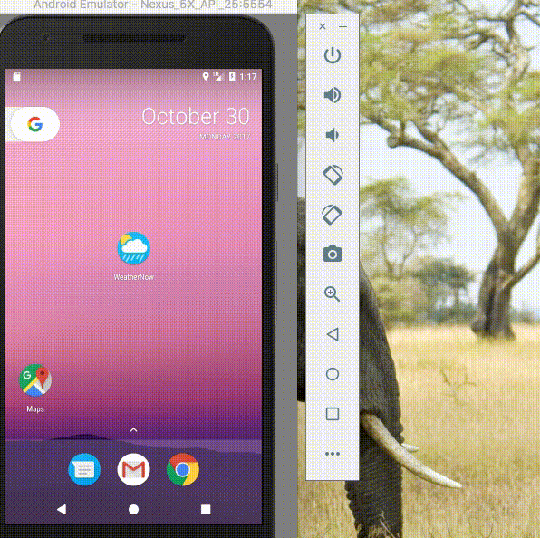

# WeatherNow

## User Stories

The following **required** functionality is completed:
* [X] The solution allows the user to search for a location and then let us see the weather forecast in that location in a recycler view. 
* [X] After an initial load user can see recent search results and the weather forecast even if the device is in airplane mode. 
* [X] In the Location Details screen the forecast is displayed the user can see the location and today’s date in the toolbar of the app.
* [X] User can see the state of the weather in each forecast row. 
* [X] Material Design Principles are followed (Cardview, Recyclerview)

The following **Optional** functionality is completed:
* [X] Implemented MVVM architecture
* [X] Dependency Injection with Dagger 2

The following **Additional** features are implemented:
* [X] Leverages the data binding support module
* [X] Changed App icon
* [X] Added a Splash screen.
* [X] Handled orientation change 
* [X] Fixed crashes and handled no response and error response from server

BackLog items:
* [ ] User can choose the temperature unit between C and F, default is C
* [ ] Add unit test cases
* [ ] Fix Lint issues

 ## Video Walkthrough 

Here's a walkthrough of implemented user stories:

